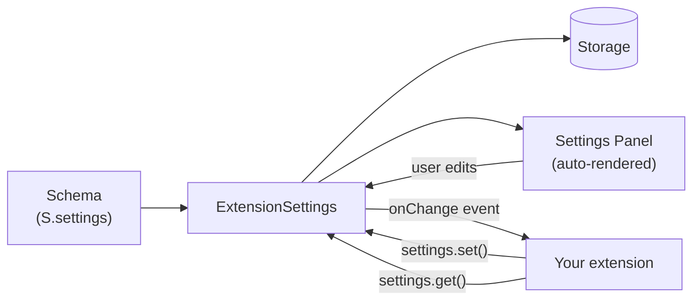

# pi-extension-settings SDK

> A type-safe, declarative settings management SDK for pi extensions.
> Define your schema once — get typed accessors, validation, autocompletion, live updates, and a rendered settings panel for free.

---

## Why this SDK?

Most extensions need settings. Most extensions end up writing the same plumbing: storage, validation, change events, UI wiring, and a set of TypeScript types that drift from the storage format over time.

This SDK removes all of that. You write **one schema** and get:

| Without the SDK                                 | With the SDK                                       |
| ----------------------------------------------- | -------------------------------------------------- |
| Hand-rolled storage keys and JSON parsing       | `settings.get("key")` returns the right type       |
| Manual validation scattered across the codebase | One `validation` field per node                    |
| UI boilerplate for every new setting            | A settings panel rendered automatically            |
| Silent type drift between storage and code      | `InferConfig<T>` enforces the type at compile time |
| Wire listeners by hand, remember to clean up    | `onChange()`, session-scoped, no cleanup required  |

---

## Feature highlights

- **End-to-end type safety.** `InferConfig<T>` derives a flat key → value map from your schema. Every `get()`, `set()`, and `onChange()` is type-checked against that map.
- **Declarative schema.** One call to `S.settings({...})` describes defaults, validation, transformation, autocompletion, and display format.
- **Rich node types.** `Text`, `Boolean`, `Enum`, `List` (structured rows), `Dict` (key/value pairs), and `Section` (nestable groups).
- **20 validators, 16 transforms, 2 completers, 5 display functions** out of the box. Compose them with `v.all`, `v.any`, `t.pipe`, `t.compose`.
- **Live updates.** Subscribe to per-key events with `onChange()`. Session-scoped — no listener cleanup required.
- **Strict runtime checks.** `S.settings()` validates tooltip length and enum defaults at construction time, so schema bugs fail fast.
- **Renders on GitHub and GitBook.** Documentation is pure CommonMark with Mermaid diagrams — no platform lock-in.

---

## Architecture at a glance



Your extension never touches storage directly. It talks to `ExtensionSettings`, which brokers reads and writes, fires change events, and keeps the UI synchronized.

---

## 60-second example

```ts
import { S, ExtensionSettings } from "pi-extension-settings/sdk";
import { v, t, d } from "pi-extension-settings/sdk/hooks";

// 1. Declare the schema
const schema = S.settings({
  "api-url": S.text({
    tooltip: "API base URL",
    default: "https://api.example.com",
    validation: v.url(),
    transform: t.normalizeUrl(),
  }),
  theme: S.enum({
    tooltip: "Color theme",
    default: "dark",
    values: ["dark", "light", "system"],
  }),
  enabled: S.boolean({
    tooltip: "Enable extension",
    default: true,
  }),
});

// 2. Create the accessor
const settings = new ExtensionSettings(pi, "my-extension", schema);

// 3. Read — fully typed
const url = settings.get("api-url"); // inferred as string
const on = settings.get("enabled"); // inferred as boolean

// 4. Write — fully typed
settings.set("theme", "light"); // ok
// settings.set("theme", 42);          // compile error

// 5. React to changes
settings.onChange("theme", (t) => applyTheme(t));
```

> **Tip:** The settings panel UI is generated from your schema automatically. You do not write any UI code.

---

## Documentation map

### Get going

| Page                                    | What you'll learn                                                     |
| --------------------------------------- | --------------------------------------------------------------------- |
| [Getting Started](./getting-started.md) | Install the SDK and ship your first integration in under five minutes |

### Concepts

| Page                                                  | What you'll learn                                        |
| ----------------------------------------------------- | -------------------------------------------------------- |
| [Concepts Overview](./concepts/README.md)             | The three core abstractions and how they fit together    |
| [Schema Builder](./concepts/schema-builder.md)        | The `S` namespace, runtime validation, and `InferConfig` |
| [Node Types](./concepts/node-types.md)                | Every node type, field by field, with a decision tree    |
| [ExtensionSettings](./concepts/extension-settings.md) | Class lifecycle, `get` / `set` / `onChange` / `getAll`   |

### Hooks

| Page                                    | What you'll learn                                             |
| --------------------------------------- | ------------------------------------------------------------- |
| [Hooks Overview](./hooks/README.md)     | The four namespaces, execution order, composition             |
| [Validators](./hooks/validators.md)     | All 20 built-in validators with examples                      |
| [Transforms](./hooks/transforms.md)     | All 16 built-in transforms with examples                      |
| [Completers](./hooks/completers.md)     | `c.filePath` and `c.staticList`                               |
| [Display Functions](./hooks/display.md) | `d.color`, `d.badge`, `d.path`, `d.dictEntry`, `d.keybinding` |

### Examples

| Page                                           | Complexity   | What it shows                                         |
| ---------------------------------------------- | ------------ | ----------------------------------------------------- |
| [Weather Widget](./examples/weather-widget.md) | Beginner     | Text, Boolean, Enum; basic validators                 |
| [Code Formatter](./examples/code-formatter.md) | Intermediate | Sections, List with Struct, numeric validation        |
| [AI Assistant](./examples/ai-assistant.md)     | Advanced     | Nested sections, Dict, `InferConfig`, full hook stack |

### Reference

| Page                                     | Use when                                          |
| ---------------------------------------- | ------------------------------------------------- |
| [API Reference](./reference/api.md)      | You want the full list of exports at a glance     |
| [Type Reference](./reference/types.md)   | You need the exact TypeScript signature of a type |
| [Error Reference](./reference/errors.md) | You need to catch a specific error class          |

---

## Quick links

- Landing an extension? Start with [Getting Started](./getting-started.md).
- Already know the basics? Jump to the [API Reference](./reference/api.md).
- Looking for a specific hook? Try the [Hooks Overview](./hooks/README.md).
- Debugging a runtime error? See the [Error Reference](./reference/errors.md).

---

<sup>Documentation drafted with AI assistance — Claude Opus 4.6 (Anthropic). Reviewed by a human maintainer before publishing.</sup>
