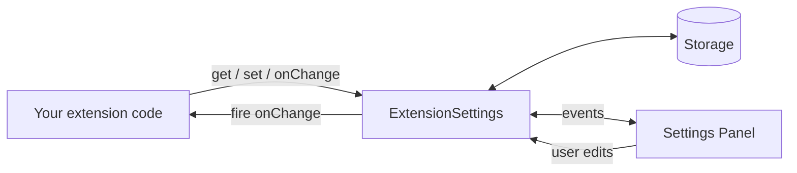
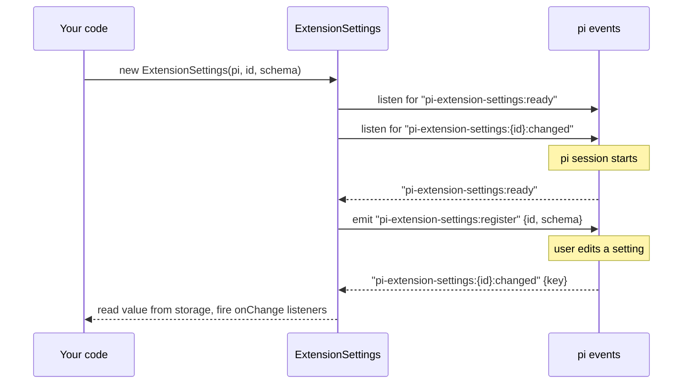
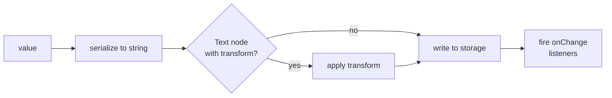

# ExtensionSettings

`ExtensionSettings` is the runtime bridge between your extension code, persistent storage, and the pi settings panel. It is constructed once per extension and provides four typed methods: `get`, `set`, `onChange`, and `getAll`.

---

## What it does



- **Registration.** On construction, it waits for the panel's `ready` event and registers your schema so the UI can render it.
- **Reads and writes.** `get()` / `set()` / `getAll()` delegate to the internal storage module, applying per-node transforms on the way in.
- **Change notifications.** `onChange()` callbacks fire in two situations: when the user saves a change in the panel, and when `set()` is called programmatically.

---

## Constructor

```ts
new ExtensionSettings<S>(
  pi: ExtensionAPI,
  extension: string,
  schema: S,
)
```

| Parameter   | Type           | Description                                                                                         |
| ----------- | -------------- | --------------------------------------------------------------------------------------------------- |
| `pi`        | `ExtensionAPI` | The pi extension API object passed to your `activate()` function.                                   |
| `extension` | `string`       | Unique identifier for your extension. Used as the storage namespace and the panel registration key. |
| `schema`    | `S`            | The object returned by `S.settings({...})`.                                                         |

**Example:**

```ts
import type { ExtensionAPI } from "@mariozechner/pi-coding-agent";
import { S, ExtensionSettings } from "pi-extension-settings/sdk";

const schema = S.settings({
  color: S.text({ description: "Accent color", default: "#ff6b6b" }),
});

export function activate(pi: ExtensionAPI) {
  const settings = new ExtensionSettings(pi, "my-extension", schema);
}
```

> **Tip:** Pick a unique `extension` identifier and keep it stable. It is the primary key for your stored settings — renaming it strands any previously saved values.

---

## Initialization lifecycle



You do not call any init method yourself. Construction alone is enough to wire everything up.

---

## `get(key)`

Returns the current value for a setting key, falling back to the schema default if nothing is stored.

```ts
get<K extends keyof InferConfig<S>>(key: K): InferConfig<S>[K]
```

- Return type is inferred from the key — no casting required.
- For nested keys, use dot notation (`"section.child"`).
- Throws [`SettingNotFoundError`](../reference/errors.md#settingnotfounderror) at runtime if the key does not exist in the schema (TypeScript generics normally catch this at compile time).

```ts
const color = settings.get("color"); // string
const enabled = settings.get("enabled"); // boolean
const theme = settings.get("appearance.theme"); // string (dot-notation for sections)
```

> **Tip:** `get()` always returns a value. If no value has been saved yet, it returns the node's `default`. You never need to handle an `undefined` "unset" state.

---

## `set(key, value)`

Writes a value to storage and fires any registered `onChange` listeners synchronously.

```ts
set<K extends keyof InferConfig<S>>(key: K, value: InferConfig<S>[K]): void
```

### Processing order



1. **Serialize** the value to its storage format (values are stored as natural JSON types: booleans as `true`/`false`, numbers as numbers, lists/dicts as native JSON).
2. **Apply `transform`** if the node is a `Text` node with a transform hook.
3. **Write** the value to storage.
4. **Fire** all `onChange` listeners for this key, in registration order, with the parsed value.

```ts
settings.set("color", "#ff6b6b");
settings.set("enabled", false);
settings.set("appearance.theme", "light");
```

> **Warning:** `set()` does not run the node's `validation` hook. Validation is enforced by the settings panel UI, not by programmatic writes. If your extension accepts untrusted input and calls `set()` directly, validate the input yourself first.

---

## `onChange(key, cb)`

Subscribes to changes for a specific setting key.

```ts
onChange<K extends keyof InferConfig<S>>(
  key: K,
  cb: (value: InferConfig<S>[K]) => void,
): void
```

- The callback receives the **new, parsed value** — already the right type.
- Listeners fire on both user-driven changes (panel edits) and programmatic `set()` calls.
- Multiple listeners for the same key fire in registration order.

```ts
settings.onChange("theme", (newTheme) => applyTheme(newTheme));
settings.onChange("appearance.font-size", (size) =>
  updateFontSize(parseInt(size, 10)),
);
```

> **Note:** Listeners are **session-scoped**. They live for the lifetime of the pi session and do not need explicit cleanup. There is no `unsubscribe` method.

---

## `getAll()`

Returns a typed snapshot of every setting in the schema. Keys with no stored value fall back to their defaults.

```ts
getAll(): InferConfig<S>
```

```ts
const config = settings.getAll();
// {
//   "api-url": "https://api.example.com",
//   "enabled": true,
//   "appearance.theme": "dark",
// }

applyConfig(config);
```

Use `getAll()` when you need to:

- Build a single consistent snapshot before performing a multi-setting operation (e.g. assembling an HTTP request).
- Initialize your extension at startup from the full config.
- Log the current config for debugging.

---

## Nested sections and dot notation

When your schema uses `S.section({...})`, leaves inside it are addressed with dot-separated key paths:

```ts
const schema = S.settings({
  model: S.section({
    description: "Model",
    children: {
      sampling: S.section({
        description: "Sampling",
        children: {
          temperature: S.text({ description: "Temperature", default: "0.7" }),
          maxTokens: S.text({ description: "Max tokens", default: "2048" }),
        },
      }),
    },
  }),
});

const settings = new ExtensionSettings(pi, "ai", schema);

// Every nested key uses dot notation
settings.get("model.sampling.temperature"); // "0.7"
settings.set("model.sampling.temperature", "0.9");
settings.onChange("model.sampling.temperature", (v) => rebuild(v));
```

`InferConfig` generates the exact key types (`"model.sampling.temperature": string`) automatically, so autocomplete in your editor surfaces all valid keys.

---

## Patterns

### Subscribe once, rerender many

```ts
function onAnyChange(
  keys: Array<keyof InferConfig<typeof schema>>,
  cb: () => void,
) {
  for (const k of keys) settings.onChange(k, cb);
}

onAnyChange(["api-url", "theme", "enabled"], rerender);
```

### Build a typed snapshot on startup

```ts
const config = settings.getAll();
startWith(config);
```

### Gate functionality behind a toggle

```ts
if (!settings.get("enabled")) return;
```

### Detect "client-affecting" setting changes

Group the keys that should trigger a client rebuild and let everything else flow through without a restart:

```ts
const clientKeys = ["endpoint", "apiKey", "model.name"] as const;
let client = buildClient(settings.getAll());

for (const k of clientKeys) {
  settings.onChange(k, () => (client = buildClient(settings.getAll())));
}
```

---

## Error handling

```ts
import {
  PiSettingsError,
  SettingNotFoundError,
} from "pi-extension-settings/sdk";

try {
  settings.get("unknown-key" as never);
} catch (err) {
  if (err instanceof SettingNotFoundError) {
    console.error(`Key "${err.key}" not found in "${err.extension}"`);
  } else if (err instanceof PiSettingsError) {
    console.error("SDK error:", err.message);
  } else {
    throw err;
  }
}
```

See [Error Reference](../reference/errors.md) for the full hierarchy and catch patterns.

---

## Related reading

- **[Schema Builder](./schema-builder.md)** — How to construct the schema this class accepts.
- **[Node Types](./node-types.md)** — Which fields are stored as what.
- **[Hooks](../hooks/README.md)** — How `transform` hooks plug into `set()`, and how `validation` is applied by the panel.

---

<sup>Documentation drafted with AI assistance — Claude Opus 4.6 (Anthropic). Reviewed by a human maintainer before publishing.</sup>
