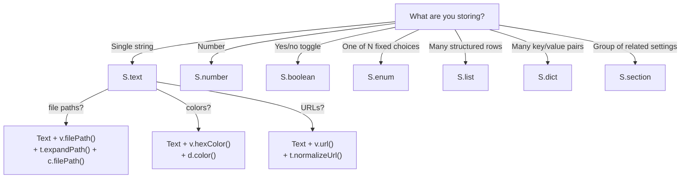

# Node Types

Every setting in a schema is a **node**. Nodes are plain TypeScript objects with a `_tag` discriminant. You construct them using `S.*` builders — never by hand.

---

## Quick reference

| Node      | Builder     | Stored type              | UI control           | Hook support                                     |
| --------- | ----------- | ------------------------ | -------------------- | ------------------------------------------------ |
| `Text`    | `S.text`    | `string`                 | Text input           | `validation`, `transform`, `complete`, `display` |
| `Number`  | `S.number`  | `number`                 | Numeric input        | `validation`, `display`                          |
| `Boolean` | `S.boolean` | `boolean`                | Toggle               | `display`                                        |
| `Enum`    | `S.enum`    | `string`                 | Cycling selector     | `display`                                        |
| `List`    | `S.list`    | `ListItem[]`             | Growable table       | `validation` (per item), `display` (per item)    |
| `Dict`    | `S.dict`    | `Record<string, string>` | Key/value editor     | `validation` (per entry), `display` (per entry)  |
| `Section` | `S.section` | _(container)_            | Collapsible group    | —                                                |
| `Struct`  | `S.struct`  | _(shape descriptor)_     | _(used by `S.list`)_ | —                                                |

---

## Which node should I use?



---

## Common fields

Every node shares two base fields:

| Field         | Type     | Required | Description                                                |
| ------------- | -------- | -------- | ---------------------------------------------------------- |
| `tooltip`     | `string` | Yes      | Short inline label next to the control. **Max 128 chars.** |
| `description` | `string` | No       | Full Markdown documentation. No length limit.              |

> [!IMPORTANT]
> The 128-character tooltip limit is enforced by `S.settings()` at construction time. Exceeding it throws `TooltipTooLongError`. Use `description` for longer content — it is rendered in an expandable sidebar only when the user opens it.

---

## `Text`

A free-form string input. The foundation for every specialized input in the SDK — color pickers, file browsers, URL fields, and numeric inputs are all just `S.text` nodes with hooks attached.

```ts
S.text({
  tooltip: "API key",
  default: "",
  validation: v.notEmpty(),
  transform: t.trim(),
  complete: c.staticList(["key-a", "key-b", "key-c"]),
  display: d.badge("#ff6b6b"),
});
```

### Fields

| Field        | Type                   | Required | Description                                          |
| ------------ | ---------------------- | -------- | ---------------------------------------------------- |
| `default`    | `string`               | Yes      | Value used when nothing is stored.                   |
| `validation` | `ValidationFn<string>` | No       | Called on input; blocks save on failure.             |
| `transform`  | `TransformFn`          | No       | Applied to the raw string before writing to storage. |
| `complete`   | `CompleteFn`           | No       | Provides async autocomplete suggestions.             |
| `display`    | `DisplayFn<string>`    | No       | Converts the stored string to a display string.      |

### Recipe: numeric input

```ts
// ✓ Preferred — get() returns a number directly
S.number({
  tooltip: "Port number",
  default: 8080,
  validation: v.all(v.integer(), v.range({ min: 1, max: 65535 })),
});

// Still valid when the value is also used as text (e.g. a version string)
S.text({
  tooltip: "Port number (string)",
  default: "8080",
  validation: v.regex(/^\d+$/, "must be a number"),
});
// settings.get() returns "8080" — parse with parseInt() when you need a number
```

### Recipe: file path input

```ts
S.text({
  tooltip: "Config file",
  default: "~/.config/app.json",
  validation: v.filePath(),
  transform: t.pipe(t.trim(), t.expandPath()),
  complete: c.filePath(),
  display: d.path(),
});
```

### Recipe: color input

```ts
S.text({
  tooltip: "Accent color",
  default: "#ff6b6b",
  validation: v.any(v.hexColor(), v.rgbColor(), v.htmlNamedColor()),
  transform: t.pipe(t.trim(), t.rgbToHex(), t.htmlNamedToHex()),
  display: d.color(),
});
```

---

## `Number`

A numeric input that stores and returns a native JS `number`. Prefer this over `S.text()` + `v.integer()` for any semantically numeric setting — `settings.get()` returns a `number` directly, so no conversion is needed.

```ts
S.number({
  tooltip: "Port number",
  default: 8080,
  validation: v.all(v.integer(), v.range({ min: 1, max: 65535 })),
});
```

### Fields

| Field        | Type                   | Required | Description                                     |
| ------------ | ---------------------- | -------- | ----------------------------------------------- |
| `default`    | `number`               | Yes      | Value used when nothing is stored.              |
| `validation` | `ValidationFn<number>` | No       | Called on input; blocks save on failure.        |
| `display`    | `DisplayFn<number>`    | No       | Converts the stored number to a display string. |

> [!NOTE]
> The numeric validators (`v.integer`, `v.positive`, `v.negative`, `v.range`) target `Number` nodes. The `v.percentage` validator also accepts `Text` nodes (0–100 range with optional `%`).

---

## `Boolean`

A toggle that flips between `true` and `false`.

```ts
S.boolean({
  tooltip: "Enable dark mode",
  default: true,
  display: (val, theme) =>
    val ? theme.fg("accent", "enabled") : theme.fg("dim", "disabled"),
});
```

### Fields

| Field     | Type                 | Required | Description                               |
| --------- | -------------------- | -------- | ----------------------------------------- |
| `default` | `boolean`            | Yes      |                                           |
| `display` | `DisplayFn<boolean>` | No       | Converts the boolean to a display string. |

---

## `Enum`

A cycling selector that steps through a fixed, ordered list of choices. Clicking the control advances to the next value — there is no free-text input.

```ts
S.enum({
  tooltip: "Log level",
  default: "info",
  values: [
    { value: "debug", label: "Debug (verbose)" },
    { value: "info", label: "Info" },
    { value: "warn", label: "Warnings only" },
    { value: "error", label: "Errors only" },
  ],
});
```

### Fields

| Field     | Type                                | Required | Description                  |
| --------- | ----------------------------------- | -------- | ---------------------------- |
| `default` | `string`                            | Yes      | Must be present in `values`. |
| `values`  | `Array<string \| { value; label }>` | Yes      | Ordered choices.             |
| `display` | `DisplayFn<string>`                 | No       |                              |

### Plain strings vs labeled entries

```ts
// Plain strings — stored value and display label are the same
values: ["dark", "light", "system"];

// Labeled entries — separate stored value and display label
values: [
  { value: "dark", label: "Dark mode" },
  { value: "light", label: "Light mode" },
  { value: "system", label: "Follow system" },
];
```

Use labeled entries when the stored value must remain stable (e.g. it is a key used by your backend) but the UI copy might change.

> [!WARNING]
> `S.settings()` verifies that `default` is present in `values` (matching against `value` for labeled entries). A mismatch throws `EnumDefaultMismatchError`.

---

## `List`

A growable list of structured objects. Each item conforms to the shape described by `items` (a `Struct`). The panel renders the list as a table with an "add" button.

```ts
S.list({
  tooltip: "Allowed origins",
  addLabel: "Add origin",
  default: [{ url: "https://localhost:3000", active: true }],
  items: S.struct({
    properties: {
      url: S.text({ tooltip: "URL", default: "" }),
      active: S.boolean({ tooltip: "Enabled", default: true }),
    },
  }),
  validation: (item) =>
    item.url ? { valid: true } : { valid: false, reason: "URL is required" },
  display: (item, theme) =>
    `${item.active ? "on " : "off"} ${theme.fg("dim", item.url)}`,
});
```

### Fields

| Field        | Type                     | Required | Description                                  |
| ------------ | ------------------------ | -------- | -------------------------------------------- |
| `default`    | `ListItem[]`             | No       | Initial contents. Defaults to `[]`.          |
| `items`      | `Struct`                 | Yes      | Schema for each row — see [Struct](#struct). |
| `addLabel`   | `string`                 | No       | Label for the "add item" button.             |
| `validation` | `ValidationFn<ListItem>` | No       | Validates each item individually.            |
| `display`    | `DisplayFn<ListItem>`    | No       | Renders the collapsed row summary line.      |

> [!NOTE]
> List items are stored as JSON. `settings.get("ignored-paths")` returns the parsed array; `settings.set()` serializes it back. You don't serialize or parse anything yourself.

---

## `Dict`

A string → string dictionary of arbitrary key/value pairs. The user can add, edit, and remove entries freely.

```ts
S.dict({
  tooltip: "HTTP headers",
  description: "Extra headers sent with every outbound request.",
  addLabel: "Add header",
  default: { "Content-Type": "application/json" },
  validation: (entry) =>
    entry.key.startsWith("X-") || entry.key === "Content-Type"
      ? { valid: true }
      : { valid: false, reason: "Only X- prefixed headers allowed" },
});
```

### Fields

| Field        | Type                      | Required | Description                            |
| ------------ | ------------------------- | -------- | -------------------------------------- |
| `default`    | `Record<string, string>`  | No       | Initial entries. Defaults to `{}`.     |
| `addLabel`   | `string`                  | No       | Label for the "add entry" button.      |
| `validation` | `ValidationFn<DictEntry>` | No       | Validates each `{ key, value }` entry. |
| `display`    | `DisplayFn<DictEntry>`    | No       | Renders a single entry row.            |

### When to pick `Dict` over `List`

- Use `Dict` when the unit is a key/value pair (HTTP headers, environment variables, aliases, feature flags).
- Use `List` when each item has multiple fields or non-string values (an array of `{ url, active, retries }` objects).

---

## `Section`

Groups related settings under a collapsible header. The `tooltip` becomes the section header label. Sections can be nested to any depth.

```ts
S.section({
  tooltip: "Appearance",
  description: "Controls the visual theme applied to the extension.",
  children: {
    theme: S.enum({
      tooltip: "Color theme",
      default: "dark",
      values: ["dark", "light"],
    }),
    advanced: S.section({
      tooltip: "Advanced",
      children: {
        "line-height": S.text({ tooltip: "Line height", default: "1.5" }),
      },
    }),
  },
});
```

### Fields

| Field      | Type                          | Required | Description                                             |
| ---------- | ----------------------------- | -------- | ------------------------------------------------------- |
| `children` | `Record<string, SettingNode>` | Yes      | Child nodes (any node type, including nested Sections). |

### Accessing nested leaves

```ts
settings.get("appearance.theme"); // "dark"
settings.get("appearance.advanced.line-height"); // "1.5"
```

`InferConfig` flattens the tree so every leaf is a dot-separated key in the resulting config type.

> [!NOTE]
> Sections are containers, not leaves. `settings.get("appearance")` is **not** valid — you always address a leaf.

---

## `Struct`

`Struct` describes the shape of each item in a `List`. It is **not** a `SettingNode` — it cannot appear at the top level of a schema.

```ts
S.struct({
  properties: {
    host: S.text({ tooltip: "Hostname", default: "" }),
    port: S.text({ tooltip: "Port", default: "22" }),
    protocol: S.enum({
      tooltip: "Protocol",
      default: "ssh",
      values: ["ssh", "sftp"],
    }),
    enabled: S.boolean({ tooltip: "Active", default: true }),
  },
});
```

> [!IMPORTANT]
> Properties are limited to **scalar** node types: `Text`, `Boolean`, and `Enum`. List items are rendered as table rows and cannot contain nested lists, dicts, or sections.

---

## Hook availability matrix

| Hook field   | Text | Number | Boolean | Enum |     List     |     Dict      | Section |
| ------------ | :--: | :----: | :-----: | :--: | :----------: | :-----------: | :-----: |
| `validation` |  ✓   |   ✓    |    —    |  —   | ✓ (per item) | ✓ (per entry) |    —    |
| `transform`  |  ✓   |   —    |    —    |  —   |      —       |       —       |    —    |
| `complete`   |  ✓   |   —    |    —    |  —   |      —       |       —       |    —    |
| `display`    |  ✓   |   ✓    |    ✓    |  ✓   | ✓ (per item) | ✓ (per entry) |    —    |

---

## What's next

- **[Schema Builder](./schema-builder.md)** — The `S.*` functions that construct these nodes.
- **[Hooks](../hooks/README.md)** — The pre-built hook factories you attach to each node.
- **[Validators](../hooks/validators.md)** — All 20 built-in validators.
- **[Examples](../examples/README.md)** — See every node type in realistic usage.

---

<sup>Documentation drafted with AI assistance — Claude Opus 4.6 (Anthropic). Reviewed by a human maintainer before publishing.</sup>
