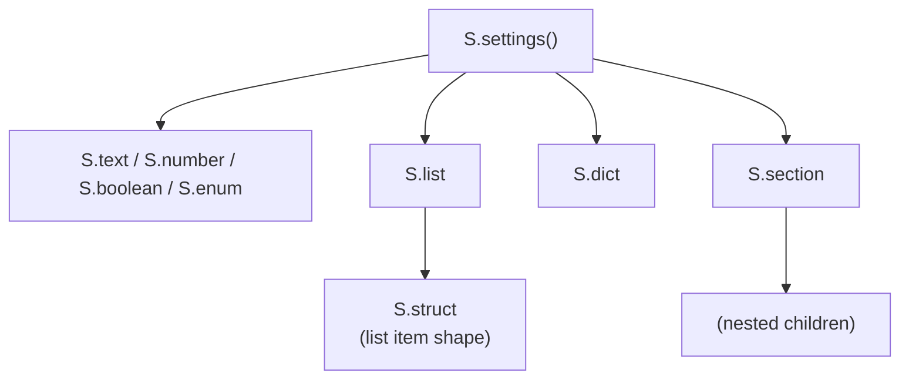
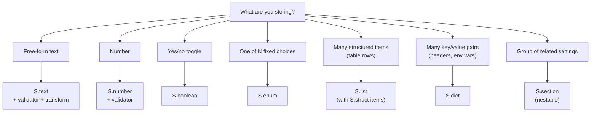

# Schema Builder

The `S` namespace is the single entry point for describing your extension's settings. Every node in a schema is constructed by calling one of the `S.*` builder functions. You never instantiate node objects directly.

---

## Mental model

A **schema** is a tree.

- **Leaves** carry values (`Text`, `Boolean`, `Enum`, `List`, `Dict`).
- **Branches** group related leaves (`Section`).
- `S.settings({...})` is the root — it validates the tree and hands it back typed.



---

## `S.settings()` — the entry point

Wraps a schema definition, runs runtime validation, and returns it with the correct TypeScript inference shape.

```ts
const schema = S.settings({
  color: S.text({ description: "Accent color", default: "#ff6b6b" }),
});
```

### Runtime validation

`S.settings()` walks the entire tree (including nested sections and list struct properties) and enforces two invariants:

| Check                                 | Error thrown                                                                  |
| ------------------------------------- | ----------------------------------------------------------------------------- |
| `description` length ≤ 128 characters | [`DescriptionTooLongError`](../reference/errors.md#descriptiontoolongerror)   |
| `Enum` default ∈ `values`             | [`EnumDefaultMismatchError`](../reference/errors.md#enumdefaultmismatcherror) |

> **Important:** These checks happen synchronously when you call `S.settings()` at module load time. Schema bugs fail fast, not silently at runtime.

### Compile-time inference

The return type carries every branch of the tree, which is what `InferConfig<T>` uses to produce the flat key → value map.

```ts
const schema = S.settings({
  color: S.text({ description: "Color", default: "" }),
});
type Config = InferConfig<typeof schema>; // { color: string }
```

---

## Which builder should I use?



---

## `S.text(opts)`

> **Note:** Hook namespaces used in the snippets below (`v`, `t`, `c`, `d`) are imported from `"pi-extension-settings/sdk/hooks"`, **not** from the root `"pi-extension-settings/sdk"`. See [Getting Started](../getting-started.md#step-1--install-and-import) for the canonical import block.

A free-form text input. Every specialized input (color picker, URL field, path browser, number field) is built on top of `S.text` by attaching hooks.

```ts
S.text({
  description: "API base URL",
  documentation: "Root URL used for every outbound HTTP request.",
  default: "https://api.example.com",
  validation: v.url(true),
  transform: t.normalizeUrl(),
  complete: c.staticList([
    "https://api.example.com",
    "https://api.staging.example.com",
  ]),
  display: d.path(),
});
```

| Field           | Type                   | Required | Description                              |
| --------------- | ---------------------- | -------- | ---------------------------------------- |
| `description`   | `string`               | Yes      | Inline label (max 128 chars).            |
| `documentation` | `string`               | No       | Full Markdown docs.                      |
| `default`       | `string`               | Yes      | Value used when nothing is stored.       |
| `validation`    | `ValidationFn<string>` | No       | Blocks save on failure.                  |
| `transform`     | `TransformFn`          | No       | Mutates the value before storage.        |
| `complete`      | `CompleteFn`           | No       | Async autocomplete suggestions.          |
| `display`       | `DisplayFn<string>`    | No       | Converts stored value to display string. |

> **Tip:** `Text` is the **only** node type that supports the full hook stack (`validation`, `transform`, `complete`, `display`). Boolean and Enum support only `display`; List and Dict support `validation` and `display` (on their items/entries).

---

## `S.number(opts)`

A numeric input that stores and returns a native JS `number`. Prefer this over `S.text()` for any semantically numeric setting.

```ts
S.number({
  description: "Port number",
  default: 8080,
  validation: v.all(v.integer(), v.range({ min: 1, max: 65535 })),
});
```

| Field           | Type                   | Required | Description                              |
| --------------- | ---------------------- | -------- | ---------------------------------------- |
| `description`   | `string`               | Yes      | Inline label (max 128 chars).            |
| `documentation` | `string`               | No       | Full Markdown docs.                      |
| `default`       | `number`               | Yes      | Value used when nothing is stored.       |
| `validation`    | `ValidationFn<number>` | No       | Blocks save on failure.                  |
| `display`       | `DisplayFn<number>`    | No       | Converts stored value to display string. |

> **Note:** The numeric validators (`v.integer`, `v.positive`, `v.negative`, `v.range`) target `Number` nodes. The `v.percentage` validator also accepts `Text` nodes (0–100 range with optional `%`).

---

## `S.boolean(opts)`

A toggle that flips between `true` and `false`.

```ts
S.boolean({
  description: "Enable dark mode",
  default: true,
  display: (val, theme) =>
    val ? theme.fg("accent", "on") : theme.fg("dim", "off"),
});
```

| Field     | Type                 | Required |
| --------- | -------------------- | -------- |
| `default` | `boolean`            | Yes      |
| `display` | `DisplayFn<boolean>` | No       |

---

## `S.enum(opts)`

A cycling selector that steps through a fixed, ordered set of choices. The user clicks to advance to the next value — there is no free-text input.

```ts
S.enum({
  description: "Log level",
  default: "info",
  values: [
    { value: "debug", label: "Debug (verbose)" },
    { value: "info", label: "Info" },
    { value: "warn", label: "Warnings only" },
    { value: "error", label: "Errors only" },
  ],
});
```

| Field     | Type                                | Required | Description              |
| --------- | ----------------------------------- | -------- | ------------------------ |
| `default` | `string`                            | Yes      | Must be one of `values`. |
| `values`  | `Array<string \| { value; label }>` | Yes      | Ordered choices.         |
| `display` | `DisplayFn<string>`                 | No       |                          |

### Plain strings vs labeled entries

```ts
// Plain strings — stored value equals display label
values: ["dark", "light", "system"];

// Labeled entries — stored value and display label are separate
values: [
  { value: "dark", label: "Dark mode" },
  { value: "light", label: "Light mode" },
  { value: "system", label: "Follow system" },
];
```

Use labeled entries when the stored value is a stable technical identifier that should not change with UI copy.

> **Warning:** If `default` is not present in `values`, `S.settings()` throws `EnumDefaultMismatchError`. The check compares against `value` (not `label`) for labeled entries.

---

## `S.list(opts)`

A growable list of structured objects. Each item has the shape defined by `items` (a `Struct`). The panel renders the list as a table with an "add item" button.

```ts
S.list({
  description: "Allowed origins",
  addLabel: "Add origin",
  default: [{ url: "https://localhost:3000", active: true }],
  items: S.struct({
    properties: {
      url: S.text({ description: "URL", default: "" }),
      active: S.boolean({ description: "Enabled", default: true }),
    },
  }),
  validation: (item) =>
    item.url ? { valid: true } : { valid: false, reason: "URL is required" },
  display: (item, theme) =>
    `${item.active ? "on " : "off"} ${theme.fg("dim", item.url)}`,
});
```

| Field        | Type                      | Required | Description                            |
| ------------ | ------------------------- | -------- | -------------------------------------- |
| `default`    | `ListItem[]`              | No       | Initial contents. Defaults to `[]`.    |
| `items`      | `Struct`                  | Yes      | See [`S.struct`](#sstructopts).        |
| `addLabel`   | `string`                  | No       | Label for the "add" button.            |
| `validation` | `ValidationFn<ListItem>`  | No       | Validates each item.                   |
| `display`    | `ListDisplayFn<ListItem>` | No       | Converts all items to display strings. |

---

## `S.dict(opts)`

A string → string dictionary of arbitrary key/value pairs.

```ts
S.dict({
  description: "HTTP headers",
  documentation: "Extra headers sent with every outbound request.",
  addLabel: "Add header",
  default: { "Content-Type": "application/json" },
  validation: (entry) =>
    entry.key ? { valid: true } : { valid: false, reason: "Key is required" },
});
```

| Field        | Type                      | Required | Description                        |
| ------------ | ------------------------- | -------- | ---------------------------------- |
| `default`    | `Record<string, string>`  | No       | Initial entries. Defaults to `{}`. |
| `addLabel`   | `string`                  | No       | Label for the "add entry" button.  |
| `validation` | `ValidationFn<DictEntry>` | No       | Validates each `{ key, value }`.   |
| `display`    | `DisplayFn<DictEntry>`    | No       | Renders a single entry row.        |

---

## `S.section(opts)`

Groups related settings under a collapsible header. The `description` field doubles as the section header label.

```ts
S.section({
  description: "Appearance",
  documentation: "Controls the visual theme applied to the extension.",
  children: {
    theme: S.enum({
      description: "Color theme",
      default: "dark",
      values: ["dark", "light"],
    }),
    advanced: S.section({
      description: "Advanced",
      children: {
        "line-height": S.text({ description: "Line height", default: "1.5" }),
      },
    }),
  },
});
```

| Field      | Type                          | Required |
| ---------- | ----------------------------- | -------- |
| `children` | `Record<string, SettingNode>` | Yes      |

Sections nest to any depth. `InferConfig` flattens them automatically using dot-separated keys:

```ts
settings.get("appearance.theme"); // "dark" | "light"
settings.get("appearance.advanced.line-height"); // "1.5"
```

> **Note:** Sections are containers, not leaves. You cannot call `settings.get("appearance")` — you address the leaves inside them.

---

## `S.struct(opts)`

Describes the shape of each item in a `List` node.

```ts
S.struct({
  properties: {
    host: S.text({ description: "Hostname", default: "" }),
    port: S.text({ description: "Port", default: "22" }),
    protocol: S.enum({
      description: "Protocol",
      default: "ssh",
      values: ["ssh", "sftp"],
    }),
    enabled: S.boolean({ description: "Active", default: true }),
  },
});
```

> **Important:**
>
> - `Struct` is **not** a `SettingNode`. It cannot appear at the top level of a schema.
> - Properties are limited to scalar types (`Text`, `Number`, `Boolean`, `Enum`). No nested lists, dicts, or sections inside a struct — list items must stay simple enough to render as table rows.

---

## `InferConfig<T>`

The TypeScript utility type that extracts the flat runtime config from a schema. Sections are transparently flattened using dot notation.

```ts
const schema = S.settings({
  "gradient-from": S.text({ description: "Start color", default: "#ff930f" }),
  appearance: S.section({
    description: "Appearance",
    children: {
      theme: S.enum({
        description: "Theme",
        default: "dark",
        values: ["dark", "light"],
      }),
    },
  }),
  keys: S.list({
    description: "SSH keys",
    items: S.struct({
      properties: { host: S.text({ description: "Host", default: "" }) },
    }),
  }),
});

type Config = InferConfig<typeof schema>;
// {
//   "gradient-from": string;
//   "appearance.theme": string;
//   "keys": ListItem[];
// }
```

This inferred type flows through every method on `ExtensionSettings`:

- `get<K extends keyof Config>(k: K): Config[K]`
- `set<K extends keyof Config>(k: K, v: Config[K]): void`
- `onChange<K extends keyof Config>(k: K, cb: (v: Config[K]) => void): void`
- `getAll(): Config`

---

## Common pitfalls

> **Caution:** **Passing a raw node object instead of calling `S.*`.** Builders stamp the internal `_tag` discriminant. Objects built by hand will not match the union type and will not work with inference.

> **Caution:** **Forgetting to wrap the top-level schema in `S.settings()`.** Without it, runtime validation never runs. Schema bugs will surface much later and much more cryptically.

> **Caution:** **Using a long description as documentation.** The 128-character limit is enforced to keep the UI scannable. Use `documentation` for long Markdown content — it has no length limit.

> **Caution:** **Nesting non-scalar nodes inside a `Struct`.** Struct properties must be `Text`, `Boolean`, or `Enum`. List items are rendered as table rows and cannot contain nested lists or sections.

---

## What's next

- **[Node Types](./node-types.md)** — Full field-by-field reference for every node type.
- **[ExtensionSettings](./extension-settings.md)** — How the runtime accessor uses the schema.
- **[Hooks](../hooks/README.md)** — The pre-built validators, transforms, completers, and display functions you attach to nodes.

---

<sup>Documentation drafted with AI assistance — Claude Opus 4.6 (Anthropic). Reviewed by a human maintainer before publishing.</sup>
