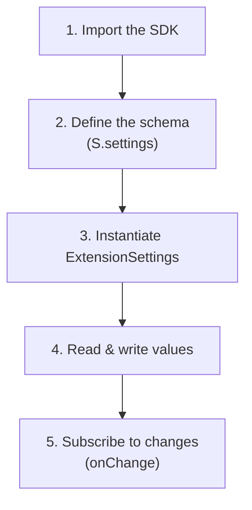

# Getting Started

This guide takes you from zero to a working, typed, panel-backed settings integration in under five minutes.

## What you'll build

A tiny pi extension with three settings:

- An **API URL** (validated as HTTPS, auto-normalized)
- A **theme** enum (`dark` / `light` / `system`)
- An **enabled** toggle

By the end you will have a fully typed accessor, a rendered settings panel, and live updates when the user changes anything.

---

## The five-step flow



---

## Prerequisites

- A pi extension with access to the `ExtensionAPI` from `@mariozechner/pi-coding-agent`.
- TypeScript — the SDK ships `.ts` source files and is authored for end-to-end type inference.

> [!NOTE]
> The SDK has no runtime dependencies beyond `@mariozechner/pi-coding-agent` (supplied by the pi host).

---

## Step 1 — Import the SDK

```ts
import {
  S, // schema builder namespace
  ExtensionSettings, // the runtime accessor class
  v, // validators
  t, // transforms
  c, // completers (not used in this quickstart)
  d, // display functions (not used in this quickstart)
} from "pi-extension-settings/sdk";
```

All four hook namespaces (`v`, `t`, `c`, `d`) are optional. Import only what you use.

---

## Step 2 — Define the schema

Call `S.settings({...})` with a map of setting keys to node definitions. The function validates your schema at runtime and returns it fully typed for inference.

```ts
const schema = S.settings({
  // A free-form URL with validation + normalization
  "api-url": S.text({
    tooltip: "API base URL",
    description: "Root URL used for every outbound HTTP request.",
    default: "https://api.example.com",
    validation: v.url(true),
    transform: t.normalizeUrl(),
  }),

  // A cycling enum with stable stored values and friendlier labels
  theme: S.enum({
    tooltip: "Color theme",
    default: "dark",
    values: [
      { value: "dark", label: "Dark" },
      { value: "light", label: "Light" },
      { value: "system", label: "Follow system" },
    ],
  }),

  // A simple on/off toggle
  enabled: S.boolean({
    tooltip: "Enable extension",
    default: true,
  }),
});
```

> [!IMPORTANT]
> Every node's `tooltip` must be **128 characters or fewer**. Use the optional `description` field for longer Markdown documentation. `S.settings()` throws `TooltipTooLongError` at construction time if this limit is exceeded.

---

## Step 3 — Instantiate ExtensionSettings

Pass the `pi` extension API, a unique extension identifier, and your schema:

```ts
import type { ExtensionAPI } from "@mariozechner/pi-coding-agent";

export function activate(pi: ExtensionAPI) {
  const settings = new ExtensionSettings(pi, "my-extension", schema);
  // ready to use
}
```

The constructor wires two pi event listeners:

- `pi-extension-settings:ready` — when the session starts, `ExtensionSettings` registers your schema with the panel automatically.
- `pi-extension-settings:{extension}:changed` — when the user saves a change in the panel, the event is scoped to your extension so only your listeners fire. The SDK re-reads the value from storage and fires registered `onChange` callbacks.

You do not call any init method yourself.

---

## Step 4 — Read and write values

```ts
// Read — fully typed return values
const apiUrl = settings.get("api-url"); // string
const theme = settings.get("theme"); // string
const enabled = settings.get("enabled"); // boolean

// Write — fully typed input values
settings.set("theme", "light");
settings.set("enabled", false);

// TypeScript errors at compile time:
// settings.set("enabled", "yes");   // Type '"yes"' is not assignable to type 'boolean'
// settings.set("unknown", true);    // Argument of type '"unknown"' is not assignable...

// Read everything at once
const all = settings.getAll();
// { "api-url": "...", theme: "dark", enabled: true }
```

> [!TIP]
> If a key has never been saved, `get()` returns the schema default. You never need to handle "undefined because unset" manually.

---

## Step 5 — React to changes

```ts
settings.onChange("theme", (newTheme) => {
  applyTheme(newTheme); // runs whenever the theme changes
});

settings.onChange("enabled", (on) => {
  if (!on) cleanup();
});
```

Listeners are **session-scoped**. They are cleaned up automatically when the extension unloads. You do not call `unsubscribe`.

Multiple listeners can be registered for the same key. They fire synchronously, in registration order, on both user-driven changes (from the panel) and programmatic ones (from `set()`).

---

## End-to-end: complete working example

Here is everything stitched together as a single file:

```ts
import type { ExtensionAPI } from "@mariozechner/pi-coding-agent";
import { S, ExtensionSettings, v, t } from "pi-extension-settings/sdk";

const schema = S.settings({
  "api-url": S.text({
    tooltip: "API base URL",
    default: "https://api.example.com",
    validation: v.url(true),
    transform: t.normalizeUrl(),
  }),
  theme: S.enum({
    tooltip: "Color theme",
    default: "dark",
    values: ["dark", "light", "system"],
  }),
  enabled: S.boolean({
    tooltip: "Enable extension",
    default: true,
  }),
});

export function activate(pi: ExtensionAPI) {
  const settings = new ExtensionSettings(pi, "my-extension", schema);

  // Kick off work based on the initial state
  if (settings.get("enabled")) {
    start(settings.get("api-url"), settings.get("theme"));
  }

  // Keep work in sync with the user's edits
  settings.onChange("enabled", (on) =>
    on ? start(settings.get("api-url"), settings.get("theme")) : stop(),
  );
  settings.onChange("api-url", (url) => restart(url));
  settings.onChange("theme", (t) => applyTheme(t));
}

function start(url: string, theme: string) {
  /* … */
}
function stop() {
  /* … */
}
function restart(url: string) {
  /* … */
}
function applyTheme(theme: string) {
  /* … */
}
```

---

## Bonus: TypeScript config inference

Optionally, extract the config type to use elsewhere in your extension:

```ts
import type { InferConfig } from "pi-extension-settings/sdk";

type MyConfig = InferConfig<typeof schema>;
// Equivalent to:
// {
//   "api-url": string;
//   theme:     string;
//   enabled:   boolean;
// }

function applyConfig(config: MyConfig) {
  // Every field is typed — no casting
}
```

`Section` nodes are transparently flattened. A schema with `appearance: S.section({ children: { theme: S.enum(...) } })` produces a key `"appearance.theme": string` in the inferred type.

---

## Common patterns

### Subscribe to several keys with one callback

```ts
function subscribeAll(
  keys: Array<keyof InferConfig<typeof schema>>,
  cb: () => void,
) {
  for (const k of keys) settings.onChange(k, cb);
}

subscribeAll(["api-url", "theme", "enabled"], rerender);
```

### Build a typed snapshot at startup

```ts
const config = settings.getAll();
applyConfig(config);
```

### Gate functionality behind a toggle

```ts
if (!settings.get("enabled")) return;
```

### Use a nested section for grouped settings

```ts
const schema = S.settings({
  appearance: S.section({
    tooltip: "Appearance",
    children: {
      theme: S.enum({
        tooltip: "Theme",
        default: "dark",
        values: ["dark", "light"],
      }),
      "font-size": S.number({
        tooltip: "Font size (px)",
        default: 14,
        validation: v.all(v.integer(), v.range({ min: 8, max: 72 })),
      }),
    },
  }),
});

settings.get("appearance.theme"); // "dark" | "light"
settings.get("appearance.font-size"); // 14
```

---

## Troubleshooting

> [!WARNING]
> **`TooltipTooLongError` at startup.** Your schema has a tooltip longer than 128 characters. Shorten it and move the extra copy into `description`, which has no length limit.

> [!WARNING]
> **`EnumDefaultMismatchError` at startup.** An enum's `default` value is not present in its `values` array. This is checked for every enum in the tree, including those inside nested sections and list struct properties.

> [!WARNING]
> **`SettingNotFoundError` at runtime.** `get()` or `set()` was called with a key that does not exist in the schema. TypeScript will normally catch this at compile time — this error only fires when keys are computed dynamically.

> [!TIP]
> Text nodes always return `string`, even for numeric values. Use `S.number()` for semantically numeric settings — `get()` returns a `number` directly. If you use `S.text()` for a numeric value, parse with `parseInt()` or `Number()` and validate with `v.range()`.

---

## Next steps

- **[Node Types](./concepts/node-types.md)** — Learn about `List`, `Dict`, and every node option.
- **[Hooks](./hooks/README.md)** — Explore all 43 pre-built hooks (20 validators, 16 transforms, 2 completers, 5 display functions).
- **[Examples](./examples/README.md)** — Browse three annotated real-world integrations, from a minimal widget to a full AI assistant.
- **[API Reference](./reference/api.md)** — Look up every public export at a glance.

---

<sup>Documentation drafted with AI assistance — Claude Opus 4.6 (Anthropic). Reviewed by a human maintainer before publishing.</sup>
