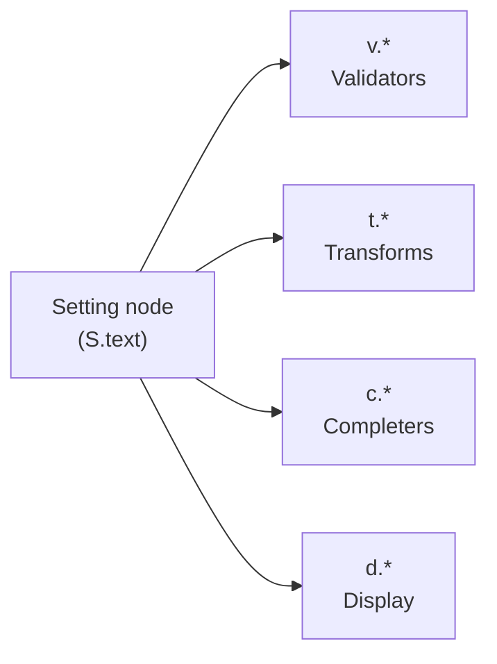
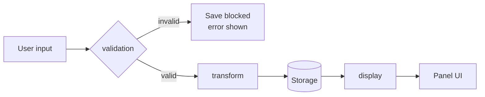

# Hooks

Hooks are functions you attach to setting nodes to control **validation**, **transformation**, **autocompletion**, and **display**. The SDK ships four namespaces of pre-built hooks, and every hook can be composed, wrapped, or replaced with your own function.

---

## The four namespaces



| Namespace | Role                                 | Imported as    | Applied to                                             |
| --------- | ------------------------------------ | -------------- | ------------------------------------------------------ |
| `v`       | **Validate** user input              | `import { v }` | `validation` field on `Text`, `Number`, `List`, `Dict` |
| `t`       | **Transform** values before storage  | `import { t }` | `transform` field on `Text`                            |
| `c`       | **Complete** user input as they type | `import { c }` | `complete` field on `Text`                             |
| `d`       | **Display** stored values            | `import { d }` | `display` field on any leaf node                       |

```ts
import { v, t, c, d } from "pi-extension-settings/sdk/hooks";
```

```ts
S.text({
  tooltip: "Config file",
  default: "",
  validation: v.all(v.notEmpty(), v.filePath()),
  transform: t.pipe(t.trim(), t.expandPath()),
  complete: c.filePath(),
  display: d.path(),
});
```

---

## Execution order

When the user saves a value, hooks run in this order:



1. **`validation`** — The raw input is tested. If it fails, the save is blocked and the failure reason is shown to the user. The value never reaches storage.
2. **`transform`** — The validated value is mutated (e.g. trimmed, normalized). Only runs on `Text` nodes.
3. **Storage** — The transformed value is written to the storage module.
4. **`display`** — The stored value is rendered in the panel using the display function.

`complete` runs independently during typing. It never blocks a save and is unaffected by validation or transformation.

> **Note:** Programmatic writes via `ExtensionSettings.set()` **skip validation**. The validator is enforced by the settings panel UI. If you call `set()` with untrusted input, validate it yourself first.

---

## Composition

Hooks become powerful when combined. The SDK ships two composition helpers per applicable namespace.

### Validators: `v.all` and `v.any`

```ts
// All must pass (first failure wins)
validation: v.all(v.notEmpty(), v.url(true));

// At least one must pass (all reasons joined on failure)
validation: v.any(v.hexColor(), v.rgbColor(), v.htmlNamedColor());
```

### Transforms: `t.pipe` and `t.compose`

```ts
// Left-to-right: trim, then normalize the URL
transform: t.pipe(t.trim(), t.normalizeUrl());

// Accept any color format, normalize to hex
transform: t.pipe(t.rgbToHex(), t.hsvToHex(), t.htmlNamedToHex());
```

> **Tip:** `t.pipe(a, b)(v)` is equivalent to `b(a(v))`. Prefer `pipe` over `compose` for readability — it reads in the same order as the transforms are applied.

---

## Hook recipes

### Accept any color format, store as hex

```ts
S.text({
  tooltip: "Accent color",
  default: "#ff6b6b",
  validation: v.any(
    v.hexColor(),
    v.rgbColor(),
    v.hsvColor(),
    v.htmlNamedColor(),
  ),
  transform: t.pipe(t.trim(), t.rgbToHex(), t.hsvToHex(), t.htmlNamedToHex()),
  display: d.color(),
});
```

### File path that exists on disk

```ts
S.text({
  tooltip: "Config file",
  default: "~/.config/app.json",
  validation: v.all(v.notEmpty(), v.filePath(true)),
  transform: t.pipe(t.trim(), t.expandPath()),
  complete: c.filePath(),
  display: d.path(),
});
```

### Positive integer with strict range

```ts
S.number({
  tooltip: "Max connections",
  default: 10,
  validation: v.all(v.integer(), v.range({ min: 1, max: 1000 })),
});
```

### HTTPS-only URL with normalization

```ts
S.text({
  tooltip: "Webhook URL",
  default: "",
  validation: v.url(true),
  transform: t.normalizeUrl(),
});
```

---

## What's in each namespace

| Namespace | Functions                                                                                                                                                                                                                | Count  | Reference                         |
| --------- | ------------------------------------------------------------------------------------------------------------------------------------------------------------------------------------------------------------------------ | :----: | --------------------------------- |
| `v`       | `notEmpty`, `regex`, `oneOf`, `all`, `any`, `filePath`, `integer`, `positive`, `negative`, `range`, `percentage`, `uri`, `uriRFC`, `url`, `hexColor`, `rgbColor`, `hsvColor`, `hsbColor`, `htmlNamedColor`, `keybinding` | **20** | [Validators](./validators.md)     |
| `t`       | `pipe`, `compose`, `expandPath`, `trim`, `lowercase`, `uppercase`, `capitalize`, `titleCase`, `camelCase`, `kebabCase`, `snakeCase`, `normalizeUrl`, `rgbToHex`, `hsvToHex`, `hsbToHex`, `htmlNamedToHex`                | **16** | [Transforms](./transforms.md)     |
| `c`       | `filePath`, `staticList`                                                                                                                                                                                                 | **2**  | [Completers](./completers.md)     |
| `d`       | `color`, `badge`, `path`, `dictEntry`, `keybinding`                                                                                                                                                                      | **5**  | [Display Functions](./display.md) |

---

## Writing your own hooks

Every hook field accepts any function that matches its type. The pre-built namespaces are conveniences — not gatekeepers.

```ts
import type {
  ValidationFn,
  TransformFn,
  CompleteFn,
  DisplayFn,
} from "pi-extension-settings/sdk";

// Custom validator
const myValidator: ValidationFn<string> = (value) =>
  value.endsWith(".json")
    ? { valid: true }
    : { valid: false, reason: "Must end in .json" };

// Custom transform
const myTransform: TransformFn = (value) => value.replace(/\\/g, "/");

// Custom async completer
const myCompleter: CompleteFn = async (partial) => {
  const all = await fetch("/api/options").then((r) => r.json());
  return all.filter((s: string) => s.startsWith(partial));
};

// Custom display
const myDisplay: DisplayFn<string> = (value, theme) =>
  value.length > 50 ? theme.fg("dim", value.slice(0, 47) + "…") : value;
```

See the [Type Reference](../reference/types.md#hook-function-types) for exact signatures.

---

## What's next

- **[Validators](./validators.md)** — All 20 built-in validators with examples.
- **[Transforms](./transforms.md)** — All 16 built-in transforms with examples.
- **[Completers](./completers.md)** — File path and static list completion.
- **[Display Functions](./display.md)** — Color swatches, badges, path collapsing.

---

<sup>Documentation drafted with AI assistance — Claude Opus 4.6 (Anthropic). Reviewed by a human maintainer before publishing.</sup>
